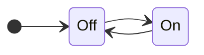
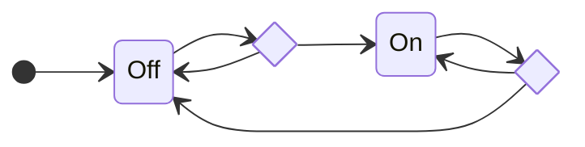
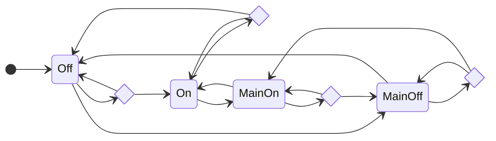

# FSM: Finite State Machine
--------

## Intro
One of the simplest models of computation is the [Finite State Machine][fsm] (FSM).  Though finite state machines are
easy to describe and understand they can still implement very complex and sophisticated solutions.  The study of FSMs
and their related phenomenon gave rise to [Automata Theory][automata] which in turn plays an important role in the
[Theory of Computation][comp-theory] and theoretical computer science in general.

Despite their deep mathematical foundations and abstract, high-level, formal definitions, FSMs can be very practical and
are, in fact, incredibly common.  I've often found use of FSM formalism in parsers, networking, compilers, and UI
design.  FSMs can also be a great tool in describing the behavior of game elements such as enemy characters, moving
objects, or even tools.  In this article I'll try to cut through some of the abstract formalism and discuss some simple
patterns that can be easily incorporated into any gaming codebase (or pretty much any modern software).

## FSMs In Simple Terms
Before we talk about how to implement FSMs, we need to first describe what an FSM is.  Let's do that without getting too
deep in mathematical formalism.  In the simplest terms an FSM is:

> An [event-driven][event-driven] program that decides _what to do_ when an event arrives based on the _state it is in_
> at the time of arrival.  

The event-driven model of programming should be very familiar to any game developer, as the event-loop is the primary
methodology for per-frame game rendering.  To write an event-driven program we need to define four elements:

* **Inputs:**  
  The set of possible events that might occur.  An input can represent anything that we might want the program to act
  upon, such as a frame tick (e.g. the `Process` method in Godot, or the `Update` method in Unity) or user input (e.g.
  a keypress or a mouse click).

* **States:**  
  The set of possible behavior modes the program might be in.  Which mode we're in will determine how the program will
  respond to the next input.

* **Variables:**  
  A place to store data between input events.  The simplest possible finite state machine has only a single variable
  that stores the _current state_.  As we will see below, more complex state machines might have additional variables.

* **Handlers:**  
  The set of handlers.  Because the program might behave differently for each _input_ depending on the _state_ it's in,
  we can formally think of the set of handlers as an [I x S] matrix of functions.  Each cell in the matrix contains the
  handler that should be called for input *I* when the machine is in state *S*.

To operate a state machine:

1. Initialize its state variables.  In particular, the variable storing the _current state_ MUST be initialized to a
   valid _start state_.
2. Loop around processing events (inputs) until the state machine _terminates_.
3. For each event, look up the appropriate handler and then execute it.

## Blinking Yellow Traffic Light
All that sounds both simple and yet complex.  To get concrete, let's look at an example.  Imagine a `blinking yellow
traffic light`.  This real world object is controlled by a finite state machine with only two states:



The machine starts in the `Off` state, and then alternates between the `On` and `Off` states every tick.  To code this
control system we can use an **Enum-FSM**.  This one of the simplest approaches (and one of my personal favorites,
especially for small FSMs).  It is clean and uncluttered, easy to implement, and easy to maintain.  Consider:

```cs
class TrafficLight 
{
  private enum States { Off, On, }

  private States m_current = States.Off;

  public void Process()
  {
    switch (m_current)
    {
    case States.Off:
      m_current = States.On; // Transition to a new state.
      Console.WriteLine(m_current);
      break;
    case States.On:
      m_current = States.Off; // Transition to a new state.
      Console.WriteLine(m_current);
      break;
    }
  }
}
```

The **Enum-FSM** design pattern satifies the four elements of an abstract FSM by:

* **Inputs:**  
  The inputs are implicitly defined by the public methods of a class.  In this case the `Process` event is the only
  input.

* **States:**  
  The states are defined by values in an enum.  Here there are only the states `Off` and `On`.  The constructors
  (or intializers) determine the starting state.

* **Variables:**  
  The members of the class define the variables including the `m_current` variable that stores the current state.

* **Handlers:**  
  The body of each _input_ method contains a `switch-statement` which switches over `m_current` and whose `case`s each
  define the behavior of one handler.  There are _I_ input methods, each of which contains _S_ case-labels.
  Collectively all these case-labels implicitly define a matrix of [I x S] handlers.

The state machine produces _outputs_ during handler executions.  In this case by writing "On" or "Off" to the console
when changing _states_.

## Conditional Transitions.
The light blinks once per tick.  That might be pretty fast.  And the tick frequency is driven by the frame rendering
rate not by any notion of wall-clock time.  We could improve this state machine by storing additional data variables
(beyond just the _current state_).  Then we can make state transitions _conditional_ not just on the _current state_,
but also on:

1. The value of additional state variables.
2. The properties of an input event (e.g. the arguments to the input methods).

### Variable Conditionals
Let's extend the `Process` input method to take _time delta_ as seconds in wall-clock time since the last frame was
rendered.  (This is a very common technique used by game engines to align handler behavior to the passage of real time
without the use of explicit timers - which are expensive.)  Consider this extended example:

```cs
/// <summary>The amount of time to delay between blinks.</summary>
private static readonly TimeSpan s_threshold = TimeSpan.FromSeconds(1);

...

/// <summary>The time spent in the current state.</summary>
private TimeSpan m_time = TimeSpan.Zero;

public void Process(TimeSpan delta)
{
  switch (m_current)
  {
    case States.Off:
      m_time += delta;
      if (m_time > s_threshold)
      {
        m_time = TimeSpan.Zero;
        m_current = States.On; // Transition to a new state.
        Console.WriteLine(m_current);
      }
      break;
    case States.On:
      m_time += delta;
      if (m_time > s_threshold)
      {
        m_time = TimeSpan.Zero;
        m_current = States.Off; // Transition to a new state.
        Console.WriteLine(m_current);
      }
      break;
  }
}
```

Here we see that state transitions are no longer triggered based strictly on the current state, but the FSM also takes
into account the `m_time` variable.  Only when `m_time` has accumulated enough time (more than `s_threshold`) does the
FSM make a state transition, otherwise the machine just stays in the same state it was in before the input happened
(this is sometimes called a _self_ transition).  The parameters of the input event (e.g. `delta`), passed as arguments
to the input methods in the **Enum-FSM** design pattern, lead to mutations of the state variables which in turn
eventually lead to state transitions.  (FSMs that trigger output based only on their state are sometimes called a
[Moore][moore] machines.)



This accumulator pattern is very common in state machines.  For example: 

* A game might spawn a magical shield around the character for `5s` (a state transition).  When the shield activation
  time is exhausted, the shield disappears (another state transition).  
* A text parser might accumulate characters until a non-symbol character is reached, at which point the parser makes a
  state transition from the symbol accumulation state to a grammar state that will consume the new symbol.

### Input Conditionals
In addition to using additional state variables to control transitions, the parameters of an input event can be directly
inolved in the transition decision.

Suppose we need to occasonally take our light out of service for maintenance.  While in maintenance mode the light
should blink red (instead of yellow) to warn people that the signal is not working normally.  Let's add new _states_ to
account for this maintanence mode and a new input that toggles the maintanence mode:

```cs
  private sealed class TrafficLight
  {
    ...

    private enum States
    {
      /// <summary>The light is off.</summary>
      Off,

      /// <summary>The light is on.</summary>
      On,

      /// <summary>The light is off (in maintenance mode).</summary>
      MaintenanceOff,

      /// <summary>The light is on (in maintenance mode).</summary>
      MaintenanceOn,
    }

    ...

    public void MaintenanceMode(bool enable)
    {
      switch (m_current)
      {
        case States.Off:
          if (enable)
          {
            m_current = States.MaintenanceOff;
          }
          break;
        case States.On:
          if (enable)
          {
            m_current = States.MaintenanceOn;
          }
          break;
        case States.MaintenanceOff:
          if (!enable)
          {
            m_current = States.Off;
          }
          break;
        case States.MaintenanceOn:
          if (!enable)
          {
            m_current = States.On;
          }
          break;
      }
    }

    public void Process(TimeSpan delta)
    {
      switch (m_current)
      {
        case States.Off:
          m_time += delta;
          if (m_time > s_threshold)
          {
            m_time = TimeSpan.Zero;
            m_current = States.On; // Transition to a new state.
            Console.WriteLine("Off");
          }
          break;
        case States.On:
          m_time += delta;
          if (m_time > s_threshold)
          {
            m_time = TimeSpan.Zero;
            m_current = States.Off; // Transition to a new state.
            Console.WriteLine("Yellow");
          }
          break;
        case States.MaintenanceOff:
          m_time += delta;
          if (m_time > s_threshold)
          {
            m_time = TimeSpan.Zero;
            m_current = States.MaintenanceOn; // Transition to a new state.
            Console.WriteLine("Off");
          }
          break;
        case States.MaintenanceOn:
          m_time += delta;
          if (m_time > s_threshold)
          {
            m_time = TimeSpan.Zero;
            m_current = States.MaintenanceOff; // Transition to a new state.
            Console.WriteLine("Red");
          }
          break;
      }
    }
  }
```

In the new `MaintenanceMode` input the parameter `enable` doesn't just modify some state variables, but directly impacts
the state transition made.  (FSMs that trigger output based on both their state and their input parameters are sometimes
called [Mealy][mealy] machines.)



## State Isomorphism
It might seem like conditional transitions bring signifantly more power to the computational complexity of FSMs.  It
appears that FSMs which use conditional transitions can solve more complex problem than those that don't.  But this
isn't actually true.  There is a computational isomorphism between state machines with conditionals and those without.

For instance, instead of storing the `m_time` accumulator variable, the FSM above could have a series of states `[ On0,
On1, ... OnThreshold ]` that represent the combined semantic meaning of being both in the `On` state and having
accumulated `n` seconds of time.  Its easy to see that this alternative formulation, while perhaps more difficult to
write in code due to its verbosity, would be equivalent computationally.

Similarly, we could have written the maintenance mode, _not_ as a state, but as a variable.  Consider:

```cs
  private sealed class TrafficLight
  {
    ...
    private enum States { Off, On }

    ... 

    /// <summary>True if in maintenance mode.</summary>
    private bool m_maintenance;

    public void MaintenanceMode(bool enable)
    {
      switch (m_current)
      {
        case States.Off:
        case States.On:
          m_maintenance = enable;
          break;
      }
    }

    public void Process(TimeSpan delta)
    {
      switch (m_current)
      {
        case States.Off:
          m_time += delta;
          if (m_time > s_threshold)
          {
            m_time = TimeSpan.Zero;
            m_current = States.On; // Transition to a new state.
            Console.WriteLine("Off");
          }
          break;
        case States.On:
          m_time += delta;
          if (m_time > s_threshold)
          {
            m_time = TimeSpan.Zero;
            m_current = States.Off; // Transition to a new state.
            if (m_maintenance)
            {
              Console.WriteLine("Red");
            }
            else
            {
              Console.WriteLine("Yellow");
            }
          }
          break;
      }
    }
  }
```

This is an equivalent FSM with fewer explicit states, but more state variables.  When designing your own FSMs, you'll
have to making a design choice between using explicit states or variables.  Some guidance I use for myself:

* Using more variables generally leads to a reduction in the total number of explicit states, but makes coding input
  handlers more complex (and therefore more likely to have bugs).  Minimizing variables generally leads to more correct
  code.
* Use explicit states for all _modal_ behavior changes.  That is, if the object has two "modes" of behavior (i.e.
  `small` and `super` in [Super Mario Brothers][super-mario]), these should always be represented by separate explicit
  states.
* Use variables for accumulators (e.g. numeric or string values) that would otherwise lead to an explosion of the
  explicit state space.

Where you decide to use explicit states versus variables is ultimately a stylistic choice.  Consider trying it both ways
to see which works best for you in each particular case.

## Nested FSMs
One of the reasons that I like the _state & variables_ formulation of FSMs is that it easily facilitates nested FSMs.
Logically, a nested FSM is strictly speaking just a larger FSM (i.e. by combining their states, inputs, and variables
together with their parent's you get a computationally equivalent machine).  (Sometimes, nested FSMs are called
_parallel substates_ because nested FSMs run concurrently with their siblings on the same inputs to their parent).  In
practice, however, nested FSMs provide a powerful abstraction for the separation of concerns between state machines, and
for reusability.  For example: 

* In a game, many different elements such as the player, an enemy, or an NPC might all be able to use magical shields.
  The shield controller state machine could easily be a nested FSM within these other elements.
* In a parser, many different grammar productions need to parse a symbol.  The symbol parsing FSM might be nested within
  these others.

In this expanded Traffic Intersection example we'll use 4 traffic lights as nested FSMs (stored in a variable in the
parent FSM):

```cs
  private sealed class TrafficIntersection
  {
    private static readonly TimeSpan s_threshold = TimeSpan.FromSeconds(1);

    private enum States { Normal, Maintenance }

    private States m_current = States.Normal;

    private readonly TrafficLight[] m_lights;

    public TrafficIntersection()
    {
      m_lights =
      [
        new TrafficLight(this, TrafficLight.Direction.North, TrafficLight.Color.Yellow),
        new TrafficLight(this, TrafficLight.Direction.East, TrafficLight.Color.Red),
        new TrafficLight(this, TrafficLight.Direction.South, TrafficLight.Color.Yellow),
        new TrafficLight(this, TrafficLight.Direction.West, TrafficLight.Color.Red),
      ];
    }

    public TimeSpan Threshold => s_threshold;
    public bool IsMaintenance => m_current == States.Maintenance;

    public void MaintenanceMode(bool enable)
    {
      m_current = enable ? States.Maintenance : States.Normal;
    }

    public void Process(TimeSpan delta)
    {
      foreach (TrafficLight l in m_lights)
      {
        l.Process(delta);
      }
    }
  }

  private sealed class TrafficLight
  {
    private enum States { Off, On }

    public enum Direction { North, South, East, West }

    public enum Color { Yellow, Red }

    private readonly TrafficIntersection m_parent;
    private readonly Direction m_direction;
    private readonly Color m_color;

    private States m_current = States.Off;
    private TimeSpan m_time = TimeSpan.Zero;

    public TrafficLight(TrafficIntersection parent, Direction direction, Color color)
    {
      m_parent = parent;
      m_direction = direction;
      m_color = color;
    }

    public void Process(TimeSpan delta)
    {
      switch (m_current)
      {
        case States.Off:
          m_time += delta;
          if (m_time > m_parent.Threshold)
          {
            m_time = TimeSpan.Zero;
            m_current = States.On; // Transition to a new state.
            Console.WriteLine($"{m_direction}: Off");
          }
          break;
        case States.On:
          m_time += delta;
          if (m_time > m_parent.Threshold)
          {
            m_time = TimeSpan.Zero;
            m_current = States.Off; // Transition to a new state.
            if (m_parent.IsMaintenance)
            {
              Console.WriteLine($"{m_direction}: {Color.Red}");
            }
            else
            {
              Console.WriteLine($"{m_direction}: {m_color}");
            }
          }
          break;
      }
    }
  }
```

Here the `TrafficIntersection` FSM manages a global notion of "maintenance mode" for all connected lights.  It handles
both the `MaintenanceMode` and `Process` inputs.  The smaller `TrafficLight` FSMs manage only the blinking of the lights
and rely on their parent for the maintenance status.  The `TrafficLight` FSM only has a single `Process` input, having
no behavior for the `MaintenanceMode` input.  The parent FSM handles some of its inputs (e.g. `Process`) by passing that
input down to its nested FSMs.

The `TrafficLight` FSM is both nested and multi-instanced within its parent `TrafficIntersection`.  The `TrafficLight`
abstraction has higher reusability than it would if it were directly merged into `TrafficIntersection`.  It could be
used to build standalone lights, two light intersections (like a pedestrian crossing), or the 4-way seen here.

## Conclusion
In this is post, we reviewed **Finite State Machines**.  We looked at the basic **Enum-FSM** design pattern.  This
design pattern is simple, clean, and easy to implement in most modern programming languages.  We examined a few of the
tradeoffs between having more explicit states and using state variables.  Lastly, we saw how state machines can be
nested to build more complex state machines or be reused as components.

In the example given in the section [Input Conditionals][#input-conditionals] we started to see how the basic
**Enum-FSM** design pattern can quickly grow unwieldly.  As the number of states increases, the size of each input
method grows in complexity.  In our next post, we'll take a look at another common FSM design pattern, called **HSMs**,
which can scale better for larger machines.  Until next time, code on!

## Previous
Read the [previous post][devlog-post8] in this series.

## Next
Read the [next post][devlog-post10] in this series.

## Feedback
Write us with [feedback][feedback].

## See Also
* [All Posts][all-posts]
* [Glossary][glossary]
* [MSC (Marymoor Studios Core libraries)][MSC]

[MSC]: https://github.com/MarymoorStudios/Core
[all-posts]: /devlog.html
[devlog-post8]: /devlog/2025-10-27-SIP
[devlog-post10]: /devlog/2025-12-16-HSM
[feedback]: mailto:feedback@marymoorstudios.com
[glossary]: /devlog/Glossary
[fsm]: https://en.wikipedia.org/wiki/Finite-state_machine
[automata]: https://en.wikipedia.org/wiki/Automata_theory
[event-driven]: https://en.wikipedia.org/wiki/Event-driven_programming
[mealy]: https://en.wikipedia.org/wiki/Mealy_machine
[moore]: https://en.wikipedia.org/wiki/Moore_machine
[super-mario]: https://en.wikipedia.org/wiki/Super_Mario_Bros.
