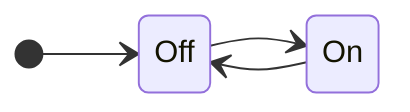

# HSM: Hierarchical State Machine
--------

## Intro
One of the simplest models of computation is the [Finite State Machine][fsm] (FSM).  Though finite state machines are
easy to describe and understand they can still implement very complex and sophisticated solutions.  The study of FSMs
and their related phenomenon gave rise to [Automata Theory][automata] which in turn plays an important role in the
[Theory of Computation][comp-theory] and theoretical computer science in general.

Despite their deep mathematical foundations and abstract, high-level, formal definitions, FSMs can very practical and
are, in fact, incredibly common.  I've often found use of FSM formalism in parsers, networking, compilers, and UI
design.  FSMs can also be a great tool in describing the behavior of game elements such as enemy characters, moving
objects, or even tools.  In this article I'll try to cut through some of the abstract formalism and discuss some simple
patterns that can be easily incorporated into any game codebase (or pretty much any modern software).

## FSMs In Simple Terms
Before we talk about how to implement FSMs, we need to first describe what an FSM is.  Let's do that without getting too
deep in mathematical formalism.  In the simplest terms an FSM is:

> An [event-driven][event-driven] program that decides _what to do_ when an event arrives based on the _state it is in_
> at the time of arrival.  

The event-driven model of programming should be very familiar to any game developer, as the event-loop is the primary
methodology for per-frame game rendering.  To write an event-driven program we need to define four elements:

* **Inputs:**  
  The set of possible events that might occur.  An input can represent anything that we might want the program to act
  upon, such as a frame tick (e.g. the `Process` method in Godot, or the `Update` method in Unity) or user input (e.g.
  a keypress or a mouse click).

* **States:**  
  The set of possible behavior modes the program might be in.  Which mode we're in will determine how the program will
  respond to the next input.

* **Variables:**  
  A place to store data between input events.  The simplest possible finite state machine has only a single variable
  that stores the current _state_.  As we will see below, more complex state machines might have additional variables.

* **Handlers:**  
  The set of handlers.  Because the program might behave differently for each _input_ depending on the _state_ it's in,
  we can formally think of the set of handlers as an [I x S] matrix of functions.  Each cell in the matrix contains the
  handler that should be called for input *I* when the machine is in state *S*.

To operate a state machine:

1. Initialize its state variables.  In particular, the variable storing the _current state_ MUST be initialized to a
   valid starting state.
2. Loop around processing events until the state machine _terminates_.
3. For each event, look up the appropriate handler and then execute it.

## An Example: Blinking Yellow Traffic Light
All that sounds both simple and rather complex.  To get concrete, let's look at an example.  Imagine a `blinking yellow
traffic light`.  This real object is controlled by a finite state machine with only two states:



The machine starts in the `Off` state, and then alternates between the `On` and `Off` states every tick.  To code this
control system we can use an **Enum-FSM**.  This one of the easiest to implement (and one of my personal favorite)
approaches.  It is clean and uncluttered.  Easy to implement, and easy to maintain.  Consider:

```cs
class TrafficLight 
{
  private enum States { Off, On, }

  private States m_current = States.Off;

  public void Process()
  {
    switch (m_current)
    {
    case States.Off:
      m_current = States.On; // Transition to a new state.
      Console.WriteLine(m_current);
      break;
    case States.On:
      m_current = States.Off; // Transition to a new state.
      Console.WriteLine(m_current);
      break;
    }
  }
}
```

The **Enum-FSM** design pattern satifies the four elements of an abstract FSM by:

* **Inputs:**  
  The inputs are implicitly defined by the public methods of a class.  In this case the `Process` event is the only input.

* **States:**  
  The states are defined by values in an enum.  Here there are only the states `Off` and `On`.  The constructor
  (intializers) determine the starting state.

* **Variables:**  
  The members of the class define the variables including the `m_current` variable that stores the current state.

* **Handlers:**  
  The body of each _input_ method contains a `switch-statement` which switches over `m_current` and whose `case`s each
  define the behavior of one handler.  There are _I_ input methods, each of which contains _S_ case-labels collectively
  which implicitly define a matrix of [I x S] handlers.

  The state machine produces _outputs_ during handler executions.  In this case by writing "On" or "Off" to the console
  when changing _states_.

## Conditional Transitions.
The light blinks once per tick.  That might be pretty fast.  And the tick frequency is driven by the frame rendering
rate not by any notion of wall-clock time.  We should improve this state machine by storing additional data variables
(beyond just the _current state_).  Then we can make state transitions _conditional_ not just on the _current state_,
but also:

1. The value of additional state variables.
2. The properties of an input event (i.e the arguments to the input method), and

### Variable Conditionals
For this example we will extend the tick input method to take _time delta_ in wall-clock time since the last frame was
rendered.  (This is a very common technique used by game engines to align handler behavior to the passage of real time
without the use of explicit timers.)  Consider this extended example:

```cs
/// <summary>The amount of time to delay between blinks.</summary>
private static readonly TimeSpan s_threshold = TimeSpan.FromSeconds(1);

...

/// <summary>The time spent in the current state.</summary>
private TimeSpan m_time = TimeSpan.Zero;

public void Process(TimeSpan delta)
{
  switch (m_current)
  {
    case States.Off:
      m_time += delta;
      if (m_time > s_threshold)
      {
        m_time = TimeSpan.Zero;
        m_current = States.On; // Transition to a new state.
        Console.WriteLine(m_current);
      }
      break;
    case States.On:
      m_time += delta;
      if (m_time > s_threshold)
      {
        m_time = TimeSpan.Zero;
        m_current = States.Off; // Transition to a new state.
        Console.WriteLine(m_current);
      }
      break;
  }
}
```

### Input Conditionals
Suppose we need to occasonally take out light out of service for maintenance.  While in maintenance the light should
blink red (instead of yellow) to warn viewers that the signal is not working normally.  Let's add new _states_ to
account for this maintanence mode and a new input that toggles maintanence mode on and off:


## Conclusion
In this is post, we talked about the Software Isolated Process or SIP as a programming methodology that promotes
dissecting complex multithreaded programs into independent segments of logic and state which can be executed
sequentially, each with their own exclusive access to a block of isolated memory.

I hope you find good uses for your SIPs.  Until next time, code on!

## Previous
Read the [previous post][devlog-post8] in this series.

## Feedback
Write us with [feedback][feedback].

## See Also
* [All Posts][all-posts]
* [Glossary][glossary]
* [MSC (Marymoor Studios Core libraries)][MSC]

[MSC]: https://github.com/MarymoorStudios/Core
[all-posts]: /devlog.html
[devlog-post8]: /devlog/2025-10-27-SIP
[feedback]: mailto:feedback@marymoorstudios.com
[glossary]: /devlog/Glossary
[fsm]: https://en.wikipedia.org/wiki/Finite-state_machine
[automata]: https://en.wikipedia.org/wiki/Automata_theory
[event-driven]: [link text](https://en.wikipedia.org/wiki/Event-driven_programming)
