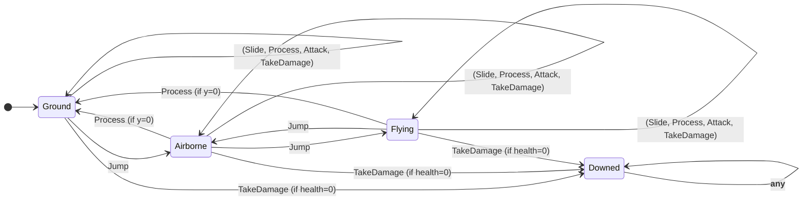
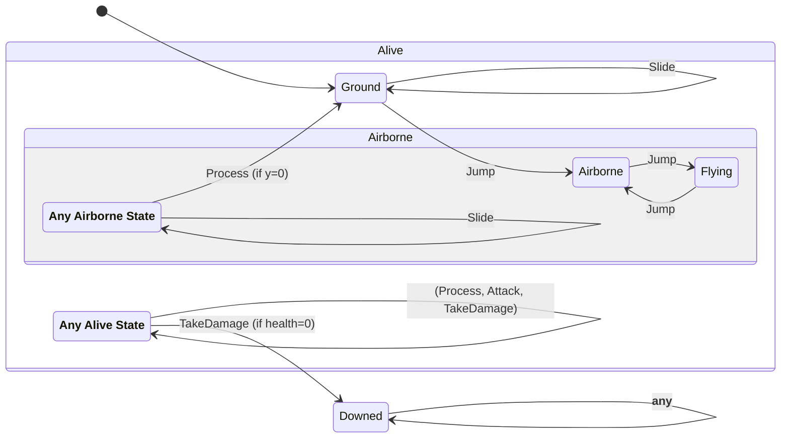

# HSM: Hierarchical State Machine
--------

## Intro
In the [previous post][devlog-post9] we took a look at [Finite State Machine][fsm].  We reviewed their 4 elements:
Inputs, States, Variables, and Handlers.  We tried out a few small examples.  We identified the common **Enum-FSM**
design pattern and saw how to use it to build simple machines.  Finally, we also saw how state machine implementations
can quickly become complex.

In this post we'll take a look at another FSM design pattern (called **HSM**) that scales a little better than
**Enum-FSM** to larger machines. However, _as always_, remember that software is all about tradeoffs.  HSMs scale better
for larger machines, but have some operational overhead in comparison to **Enum-FSM**.  For shear performance, the
**Enum-FSM** can have significant advantages for smaller FSMs.  So always use your judegment when choosing the right
tool for the job.

## Redundant Handlers
One of the main challenges with FSMs is dealing with growth in the number of handlers.  As we saw in the previous post
the logical number of handlers grows as `I x S`.  For even modest values for `I` and `S` this number can grow quickly
and make the resulting code hard to manage.  In particular, many states often have identical behavior for a given
input.  Implementing each `I x S` explicitly can lead to redundant handlers.

Let's walk through a simple example to see this redundancy in action.  Consider a simple Player Controller state machine
for a 2D platformer game.  In this game, the player can control three buttons: `Attack`, `Jump`, and `Slide`.
Additionally, the player can be damaged by their enemy, and the controller must update its physics simulation on each
game tick.  All together, this leads us to an FSM with 5 inputs: 

```cs
    public void Attack(Enemy e) { ... }
    public void TakeDamage(int damage) { ... }
    public void Jump() { ... }
    public void Slide() { ... }
    public void Process(TimeSpan delta) { ... }
```

Let's say our player can enter "flight" mode by doubling jumping (i.e. jumping while already in the air).  And, let's
assume that sliding when in the air does nothing (because what would you slide on???).  Then we can define 4 states
that the player might be in:

```cs
    private enum States
    {
      Ground,   // On the ground (normal starting state)
      Airborne, // In the air (i.e. jumping)
      Flying,   // In the air flying (i.e. no gravity)
      Downed,   // Defeated by the enemy (i.e. can't do anything until revived).
    }
```

These inputs and states leads to this FSM (with `5 x 4 = 20` handlers!):



Even when we visually combine the arrows for multiple inputs that have the same path, the resulting state diagram is
complex and hard to follow.

## Statecharts
The ideas behind HSMs stem from a landmark paper by David Harel published in 1987 called [Statecharts][statecharts] that
outlined a visual formalism for drawing FSMs.  The proposal in *Statecharts* was to recognize that, with respect to a
given input, multiple states form a group where their behavior is identical.  When drawing the diagram, all such states
can be collapsed under that group, and the shared identical transitions can be drawn only once, originating from the
_group_ itself rather than any specific member state.  When reading the chart, if there no explicit transition exists
for a given input, then consult its parent group (recusively) until one is found.

A _Statechart_ representation of the above diagram might look something like:



This state diagram is argueably a lot easier to understand.  For instance, the relationship between `Jump`, `double
Jump`, and `triple Jump` is easy to follow.  And the chart makes it clear that gravity will bring an airborne player
back down to the ground during the physics update.

Similarly, the simple relationship between `TakeDamage` and the **Downed** state is not lost to the noise of redundant
expression.  Finally, the diagram makes it clear that physics (`Process`), `Attack` and `TakeDamage` don't change their
behavior when the player takes to the air.

## Hierarchical State Machines
These visual groupings helped simplify our state diagrams.  Perhaps they can also help with the structure of our code?
Hierarchical State Machines (HSM) stem from the application of subtype polymorphism (see the [Liskov Substitution
Principle][liskov-principle]) to the implementation of input handlers.  In an object-oriented environment, we can see
that the visual groupings in the _Statechart_ also satisfy the definition of a _supertype_ where shared handlers are
defined by virtual methods which are implemented in the supertype and overriden (only when needed) in its subtypes.  The
HSM design pattern is also sometimes called the [State Pattern][state-pattern] because it defines one-class-per-state.

To apply this pattern to our example, we can define an abstract base class that captures the input definitions as the
root of our state class hierarchy.  For our Player Controller this might look like:

```cs
    private abstract class States
    {
      public abstract void Attack(HeroHsm data, Enemy e);
      public abstract void TakeDamage(HeroHsm data, int damage);
      public abstract void Jump(HeroHsm data);
      public abstract void Slide(HeroHsm data);
      public abstract void Process(HeroHsm data, TimeSpan delta);
    }
```

Then from this we can define abstract subtypes for each grouping, and concrete subtypes for each explicit state.  

```cs
    private abstract class AliveState : States
    {
      public override void Attack(HeroHsm data, Enemy e) { ... }
      public override void TakeDamage(HeroHsm data, int damage) { ... }
      public override void Process(HeroHsm data, TimeSpan delta) { ... }
    }

    private sealed class GroundState : AliveState
    {
      public override void Jump(HeroHsm data) { ... }
      public override void Slide(HeroHsm data) { ... }
    }

    private class AirborneState : AliveState
    {
      public override void Jump(HeroHsm data) { ... }
      public override void Slide(HeroHsm data) { ... }
    }

    private sealed class FlyingState : AirborneState
    {
      public override void Jump(HeroHsm data) { ... }
    }

    private sealed class DownedState : States
    {
      public override void Attack(HeroHsm data, Enemy e) { ... }
      public override void TakeDamage(HeroHsm data, int damage) { ... }
      public override void Jump(HeroHsm data) { ... }
      public override void Slide(HeroHsm data) { ... }
      public override void Process(HeroHsm data, TimeSpan delta) { ... }
    }
```

Note, that we provide implementations ONLY at the points in the hierarchy where the behavior actually changes, thus
eliminating all handler redundancy.  Furthermore, let's acknowledge that `AirborneState` implements both a grouping and
a explicit state at the same time, and that `FlyingState` further overrides the `Jump` handler implemented by its
supertype.

These _state classes_ have no variables of their own.  Obviously, we need the values stored in the variables to carry
over from state to state when we make state transitions.  So, the variables must be stored somewhere else.  In the HSM
design pattern the variables are stored in a _data_ class whose instance is passed in to each handler as an argument.
This allows us to use a singleton pattern for our _state classes_ which eliminates the need for extraneous GC
allocations:

```cs
    private static class State
    {
      public static readonly States Ground = new GroundState();
      public static readonly States Airborne = new AirborneState();
      public static readonly States Flying = new FlyingState();
      public static readonly States Downed = new DownedState();
    }
```

To utilize our state instances we'll replace our _current state_ variable with a pointer to the singleton instance of
the _state class_ which corresponds to the current state of the FSM.  Changing states becomes an assignment to a named
singleton constants (instead of the enum constants we saw in the **Enum-FSM** pattern).  We then leverage the behavior
implemented in the _state classes_ by dispatch each input through the virtual methods defined on the abstract root class
`States` (which all of our _state classes_ dervive from):

```cs
  private sealed class HeroHsm
  {
    private States m_current = State.Ground;  // Transition to the Ground state.

    ...

    public void Attack(Enemy e)
    {
      m_current.Attack(this, e);
    }

    ...

    private sealed class FlyingState : AirborneState
    {
      public override void Jump(HeroHsm data)
      {
        // Jumping while flying leads to falling back down.
        data.m_gravity = s_gravity;
        data.m_current = State.Airborne;
      }
    }
}
```

And that's it!  The handler implementations cause transitions by assigning `m_current`, as shown in the
`FlyingState.Jump` handler above.  Subsequent calls to other input methods (like the `Attack` input shown above) will
then dispatch through the new state and lead to new behavior.

> [!NOTE]  
> Incidentally, [Professor Liskov][liskov] was my teacher in undergraduate studies as well as my adviser in graduate
> school. To her, more than anyone, I owe my interest in and great love for type systems and programming methodology.
> Thank you, Professor Liskov, for your _many_ contributions to the field!

## Transition Validation

<!-- Write this -->

## Reentrancy

<!-- Write this -->

## Conclusion
In this is post, we reviewed **Finite State Machines**.  We looked at the basic **Enum-FSM** design pattern.  This
design pattern is simple, clean, and easy to implement in most modern programming languages.  We examined a few of the
tradeoffs between having more explicit states and using state variables.  Lastly, we saw how state machines can be
nested to build more complex state machines or be reused as components.

In the example given in the section [Input Conditionals][#input-conditionals] we started to see how the basic
**Enum-FSM** design pattern can quickly grow unwieldly.  As the number of states increases, the size of each input
method grows in complexity.  In our next post, we'll take a look at another common FSM design pattern, called **HSMs**,
which can scale better for larger machines.  Until next time, code on!

## Previous
Read the [previous post][devlog-post9] in this series.

## Feedback
Write us with [feedback][feedback].

## See Also
* [All Posts][all-posts]
* [Glossary][glossary]
* [MSC (Marymoor Studios Core libraries)][MSC]

[MSC]: https://github.com/MarymoorStudios/Core
[all-posts]: /devlog.html
[devlog-post9]: /devlog/2025-11-26-FSM
[feedback]: mailto:feedback@marymoorstudios.com
[glossary]: /devlog/Glossary
[fsm]: https://en.wikipedia.org/wiki/Finite-state_machine
[automata]: https://en.wikipedia.org/wiki/Automata_theory
[event-driven]: https://en.wikipedia.org/wiki/Event-driven_programming
[mealy]: https://en.wikipedia.org/wiki/Mealy_machine
[moore]: https://en.wikipedia.org/wiki/Moore_machine
[super-mario]: https://en.wikipedia.org/wiki/Super_Mario_Bros.
[statecharts]: https://www.sciencedirect.com/science/article/pii/0167642387900359
[liskov-principle]: https://en.wikipedia.org/wiki/Liskov_substitution_principle
[liskov]: https://en.wikipedia.org/wiki/Barbara_Liskov
[state-pattern]: https://en.wikipedia.org/wiki/State_pattern
