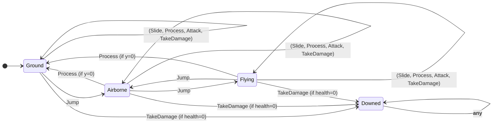
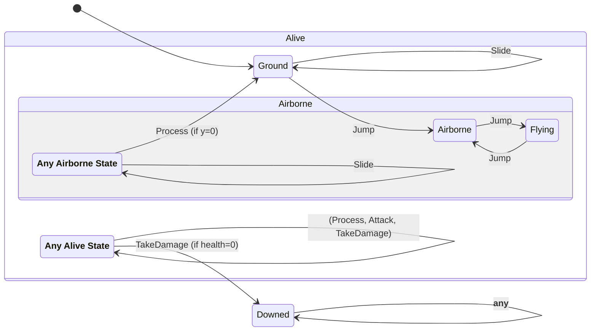
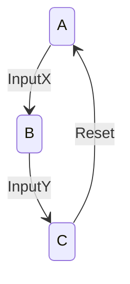
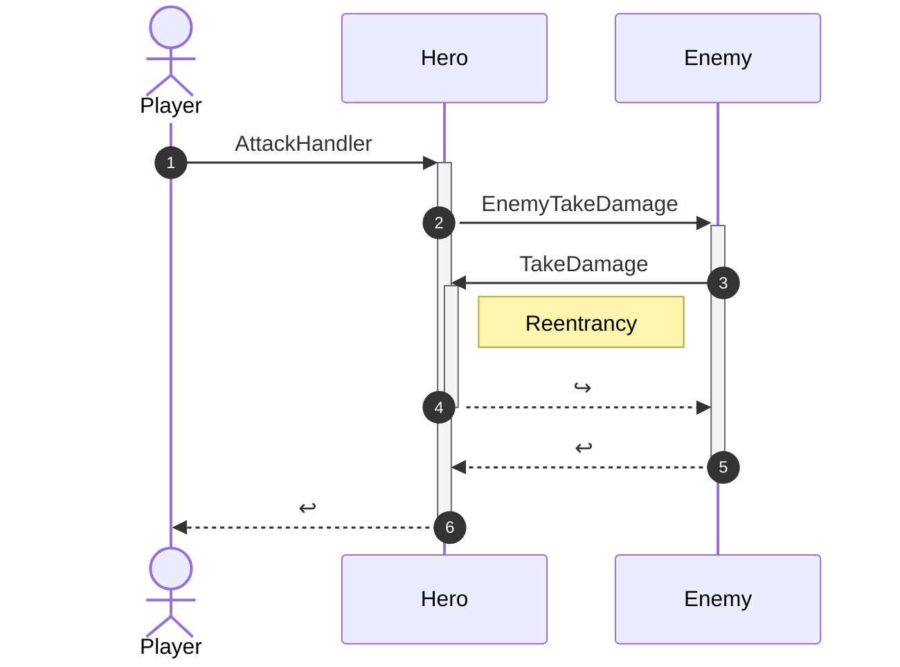

# HSM: Hierarchical State Machine
--------

## Intro
In the [previous post][devlog-post9] we took a look at [Finite State Machines][fsm].  We reviewed their 4 elements:
Inputs, States, Variables, and Handlers.  We tried out a few small examples.  We identified the common **Enum-FSM**
design pattern and saw how to use it to build simple machines.  Finally, we also saw how state machine implementations
can quickly become complex.

In this post we'll take a look at another FSM design pattern (called **HSM**) that scales a little better than
**Enum-FSM** to larger machines. However, _as always_, remember that software is all about tradeoffs.  HSMs scale better
for larger machines, but have some operational overhead in comparison to **Enum-FSM**.  For shear performance, the
**Enum-FSM** can have significant advantages for smaller FSMs.  So always use your judgment when choosing the right
tool for the job.

## Redundant Handlers
One of the main challenges with FSMs is dealing with growth in the number of handlers.  As we saw in the previous post
the logical number of handlers grows as `I x S`.  For even modest values of `I` and `S` this number can grow quickly and
make the resulting code hard to manage.  In particular, many states often have identical behavior for a given input.
Implementing each `I x S` explicitly can lead to redundant handlers.

Let's walk through a simple example to see this redundancy in action.  Consider a simple Player Controller state machine
for a 2D platformer game.  In this game, the player can control three buttons: `Attack`, `Jump`, and `Slide`.
Additionally, the player can be damaged by their enemy, and the Player Controller must update its physics simulation on
each game tick.  All together, this leads us to an FSM with 5 inputs: 

```cs
    public void Attack(Enemy e) { ... }
    public void TakeDamage(int damage) { ... }
    public void Jump() { ... }
    public void Slide() { ... }
    public void Process(TimeSpan delta) { ... }
```

Let's say our player can enter "flight" mode by doubling jumping (i.e. jumping while already in the air).  And, let's
assume that sliding when in the air does nothing (because what would you slide on???).  Then we can define 4 states
that the player might be in:

```cs
    private enum States
    {
      Ground,   // On the ground (normal starting state)
      Airborne, // In the air (i.e. jumping)
      Flying,   // In the air flying (i.e. no gravity)
      Downed,   // Defeated by the enemy (i.e. can't do anything until revived).
    }
```

These inputs and states leads to this FSM (with `5 x 4 = 20` handlers!):



Even when we visually combine the arrows for multiple inputs that have the same path (like `Ground : (Slide, Process,
Attack, TakeDamage)`, the resulting state diagram is complex and hard to follow.

## Statecharts
The idea behind HSMs stem from a landmark paper by David Harel published in 1987 called [Statecharts][statecharts] that
outlined a visual formalism for drawing FSMs.  The proposal in *Statecharts* was to recognize that, with respect to a
given input, multiple states can form a group where their behavior is identical.  When drawing the diagram, all such
states can be collapsed together under that group, and the shared identical transitions can be drawn only once,
originating from the _group_ itself rather than any specific member state.  When reading the chart, if no explicit
transition exists for a given input, then consult its parent group (recursively) until one is found.

A _Statechart_ representation of the above diagram might look something like:



This state diagram is arguably _a lot_ easier to understand.  For instance, the relationship between `Jump`, `double
Jump`, and `triple Jump` is easy to follow.  And the chart makes it clear that gravity will bring an airborne player
back down to the ground during the physics update.  Similarly, the simple relationship between `TakeDamage` and the
**Downed** state is not lost to the noise.  Finally, the diagram makes it clear that physics (`Process`), `Attack` and
`TakeDamage` don't change their behavior when the player takes to the air.

## Hierarchical State Machines
Visual groupings helped simplify our state diagram.  Perhaps they can also help with the structure of our code?
Hierarchical State Machines (HSM) stem from the application of subtype polymorphism (see the [Liskov Substitution
Principle][liskov-principle]) to the implementation of input handlers.  In an object-oriented environment, we can see
that the visual groupings in the _Statechart_ also satisfy the definition of a _supertype_ where shared handlers are
defined by virtual methods which are implemented in the supertype and overriden (only when needed) in its subtypes.  The
HSM design pattern is sometimes called the [State Pattern][state-pattern] as it defines one-class-per-state.

To apply this pattern to our example, we can define an abstract base class that captures the input definitions.  This
class will be the root of our state class-hierarchy.  For our Player Controller this might look like:

```cs
    private abstract class States
    {
      public abstract void Attack(HeroHsm data, Enemy e);
      public abstract void TakeDamage(HeroHsm data, int damage);
      public abstract void Jump(HeroHsm data);
      public abstract void Slide(HeroHsm data);
      public abstract void Process(HeroHsm data, TimeSpan delta);
    }
```

Then, deriving from this, we can define abstract subtypes for each grouping, and concrete subtypes for each explicit
state.  

```cs
    private abstract class AliveState : States
    {
      public override void Attack(HeroHsm data, Enemy e) { ... }
      public override void TakeDamage(HeroHsm data, int damage) { ... }
      public override void Process(HeroHsm data, TimeSpan delta) { ... }
    }

    private sealed class GroundState : AliveState
    {
      public override void Jump(HeroHsm data) { ... }
      public override void Slide(HeroHsm data) { ... }
    }

    private class AirborneState : AliveState
    {
      public override void Jump(HeroHsm data) { ... }
      public override void Slide(HeroHsm data) { ... }
    }

    private sealed class FlyingState : AirborneState
    {
      public override void Jump(HeroHsm data) { ... }
    }

    private sealed class DownedState : States
    {
      public override void Attack(HeroHsm data, Enemy e) { ... }
      public override void TakeDamage(HeroHsm data, int damage) { ... }
      public override void Jump(HeroHsm data) { ... }
      public override void Slide(HeroHsm data) { ... }
      public override void Process(HeroHsm data, TimeSpan delta) { ... }
    }
```

Note, that we provide overrides ONLY at the points in the hierarchy where the behavior actually changes, thereby
eliminating all handler redundancy.  Furthermore, let me point out that `AirborneState` implements both a grouping and a
explicit state at the same time, and that `FlyingState` further overrides the `Jump` handler implemented by its
supertype.

These _state classes_ have no variables of their own.  Obviously, we need the values stored in the variables to carry
over from state to state when we make state transitions.  So, the variables MUST be stored somewhere else.  In the HSM
design pattern, the variables are stored in a _data_ class whose instance is passed in to each handler as an argument.
This allows us to use a singleton pattern for our _state classes_ which eliminates the need for extraneous GC
allocations:

```cs
    private static class State
    {
      public static readonly States Ground = new GroundState();
      public static readonly States Airborne = new AirborneState();
      public static readonly States Flying = new FlyingState();
      public static readonly States Downed = new DownedState();
    }
```

To utilize our state instances we'll replace our _current state_ enum variable with a pointer to the singleton instance
of the _state class_ which corresponds to the current state of the FSM.  Changing states becomes an assignment to a
named singleton constants (instead of the enum constants we saw in the **Enum-FSM** pattern).  We then leverage the
behavior implemented in the _state classes_ by dispatching each input through the virtual methods defined on the
abstract root class `States` (which all of our _state classes_ derive from):

```cs
  private sealed class HeroHsm
  {
    private States m_current = State.Ground;  // Start in the Ground state.

    ...

    public void Attack(Enemy e)
    {
      m_current.Attack(this, e);  // Dispatch inputs through the virtual methods.
    }

    ...

    private sealed class FlyingState : AirborneState
    {
      public override void Jump(HeroHsm data)
      {
        // Jumping while flying leads to falling back down.
        data.m_gravity = s_gravity;
        data.m_current = State.Airborne;
      }
    }
}
```

And that's it!  The handler implementations cause transitions by assigning `m_current`, as shown in the
`FlyingState.Jump` handler above.  Subsequent calls to other input methods (like the `Attack` input shown above) will
then dispatch through the new state and lead to new behavior.

> [!NOTE]  
> [Professor Liskov][liskov] was my professor in undergraduate studies and my graduate adviser. She, more than anyone,
> helped me learn to appreciate type systems and programming methodology.

## State Diagrams
You'll notice that throughout my posts about FSMs I have used _state diagrams_ to both declare and visualize the state
machines that we have been working with.  In this blog I use [mermaid][mermaid] to declare the FSM using a special
textual syntax, such as this:

```text
stateDiagram-v2
  A --> B : InputX
  B --> C : InputY
  C --> A : Reset
```



While the visualizations are certainly nice... For _me_, the real power of these diagrams lies more in the declarative
nature of the syntax used to produce them.  Using declarative language to describe, at a very high level, the structure
of an FSM forces me to think about its design.  In the declaration, you can see all of the states together on one page
(not spread out across the code in different methods).  You can see the intended transitions between them and which
inputs will cause those transitions.  I always do the design first, and then code it.  And _you_ don't even need fancy
tools like [mermaid][mermaid] to declare an FSM design.  For simple FSMs, I'll often just write the declaration in
simple text comments at the top of the class, using any syntax I choose.  As long as it is clear, it is good enough.

One of the benefits of an FSM declaration is that you can easily see which inputs are allowed to cause transitions
between which states.  If you are a firm believer in invariants and asserts (and you _know_ that I am), then you might
find it valuable to sprinkle asserts in your input dispatch methods to verify that ONLY valid state transitions are
occurring.  These asserts often catch bugs either in the code (where a handler transitioned to the wrong state) or in
the design (where an interaction was not properly accounted for).

For example, state transition validation for the `Jump` input might look something like:

```cs
    public void Jump()
    {
      States self = m_current;
      m_current.Jump(this);
      Contract.Assert((self == State.Ground && m_current == State.Airborne) ||
                      (self == State.Airborne && m_current == State.Flying) ||
                      (self == State.Flying && m_current == State.Airborne));
    }
```

If the `Jump` handler doesn't result in one of these outcomes then there MUST be a bug.  Perhaps the handler forgot to
assign `m_current` to the appropriate new state?  Or worse, perhaps it assigned it to the wrong state by accident?  At
any rate, which transitions are valid (and so which asserts to write) is made immediately clear by looking at the FSM
declaration.

## Reentrancy
Back in the post [RPC1](/devlog/2025-05-29-RPC1#message-interleaving) we discussed reentrancy and the importance of the
[Top of Turn property][define-tot] in message ordering.  Reentrancy is a hazard, _not only_ to RPC messaging, but to all
software, and FSMs are not exempt.  Reentrancy hazards are a common occurrence in games due to the frequent use of FSMs.
How can unintentional or unexpected reentrancy lead to bugs?  Let's see an example.

Imagine our `Attack` and `TakeDamage` handlers looked like this:

```cs
      public sealed override void Attack(HeroHsm data, Enemy e)
      {
        e.TakeDamage(damage: s_attackDamage, attacker: data.m_hero);
        data.m_current = State.BattleMode;
      }
      public sealed override void TakeDamage(HeroHsm data, int damage)
      {
        data.m_health = Math.Max(0, data.m_health - damage);
        if (data.m_health <= 0)
        {
          data.m_current = State.Downed;
        }
      }
```

Now, imagine that `Enemy` has some kind of shield or armor that reflects a portion of the damage delt (e.g.
[Thorns][minecraft-thorns]).  The Enemy's `TakeDamage` handler might look like:

```cs
  private void EnemyTakeDamage(Hsm data, int damage, Hero attacker)
  {
    data.m_health = Math.Max(0, data.m_health - damage);
    data.m_current = (data.m_health <= 0) ? State.Dead : State.Stunned;

    if (data.m_hasReflectDamage) 
    {
        attacker.TakeDamage(damage * data.m_reflectDamage);  // Reflect some % of damage back.
    }
  }
```

When the player presses the `Attack` button near an Enemy, then `Hero.Attack` will be called triggering the `Attack`
handler which will then call `Enemy.TakeDamage` which will in turn trigger the `EnemyTakeDamage` handler, which will
(finally) call `Hero.TakeDamage` which will _then_ trigger the `TakeDamage` handler.  Reentrancy!  We are STILL in the
middle of executing the hero's `Attack` handler, but we have re-entered the Hero FSM to execute its `TakeDamage`
handler.



OK, so what?  The code will complete (i.e. there is no infinite recursion here).  Why is this bad?  Well, suppose the
Hero was low on health?  If the reflected damage caused the Hero's health to drop to zero, then the Hero would move into
the `Downed` state.  But!  Once `TakeDamage` returns, and then `EnemyTakeDamage` returns, the `Attack` handler would
continue executing and set the Hero FSM's `m_current` to the `BattleMode` state.  Thus, our Hero was accidentally
brought back to life by a reentrancy bug!!!

Fixing this kind of issue is non-trivial, particularly without violating the principle of [Local
Reasoning][define-local].  The reentrancy in this example comes about because two different abstractions call into each
other.  It is impossible to detect this kind of reentrancy without looking at both abstractions (thus forcing Global
Reasoning).  Even if the code doesn't exhibit this kind of reentrancy when it is first written, reentrancy could easily
be accidentally introduced in a subsequent modification.  For instance, perhaps the `thorns armor` feature didn't exist
in V1, but was introduced later in an update.

Working around the reentrancy can sometimes be successful, but is often brittle and can cause other issues.  For
instance, if we tried to correct this bug by moving the `Attack` handler's assignment `data.m_current =
State.BattleMode` **before** the call to `e.TakeDamage` then the assignment within the `TakeDamage` handler to the
`Downed` state is no longer lost.  BUT, the reentrancy will lead `Hero` to be in the `Downed` state after the `Attack`
handler returns.  BUT, the `Attack` input has no valid transition to the `Downed` state.  If we had added transition
validation asserts, then they would fire because this is a transition not allowed by the state diagram!  We could
continue to pull the thread of hacks by adding the `Downed` state transition to the `Attack` state, but you can quickly
see that this ultimate makes the set of valid transitions almost impossible to reason about.  To know which transitions
are valid it is no longer enough to just look at the state diagram, instead you need to understand every interaction
between handlers... leading us back to _Global Reasoning_.

## Deferred Input Reentrancy Execution
What can we do?  What is the proper solution?  Deferred Input Reentrancy Execution (DIRE).  Like we saw in the async
message dispatch model, we need to defer executing additional handlers for inputs triggered during an already executing
handler.  I.e. we MUST restore the [Top of Turn property][define-tot] before dispatching additional handlers.  DIRE
gives us both correct-by-construction execution AND guaranteed Local Reasoning.  Regardless whether a handler is
triggered directly or reentrantly, its view of the variables (including the `m_current`) is a **Top of Turn** view, and
any state transitions can be reasoned about (and validated) on a per-handler basis &mdash; just as they are depicted in
the _state diagram_.

Implementing DIRE can be _complex_.  A full description of how to do so is beyond the scope of this post.  So, I'll just
leave that as an exercise for the reader. &#x1F61C;  However, if you want to see a full implementation of DIRE in
action, along with a C#-based FSM declaration language, automatic code generation of HSM boilerplate, and a bunch of
other advanced features like OnEntry/OnExit handlers, then check out the new [MarymoorStudios.Core.Fsm][fsm-lib] library
recently added to [MSC][MSC] suite.

```cs
      m.Composite(State.Init,
        [
          m.Composite(State.Alive,
            [
              m.State(State.Ground)
               .Edge(i.Jump, x.GroundJump, State.Airborne)
               .Edge(i.Slide, x.GroundSlide),
              m.Composite(State.Airborne,
                [
                  m.State(State.Flying)
                   .Edge(i.Jump, x.FlyingJump, State.Airborne),
                ])
               .Edge(i.Jump, x.AirborneJump, State.Flying)
               .Edge(i.Slide, x.AirborneSlide),
            ])
           .Edge(i.Attack, x.AliveAttack)
           .Edge(i.TakeDamage, x.AliveTakeDamage, State.Self, State.Downed)
           .Edge(i.Process, x.AliveProcess, State.Self, State.Ground),
          m.State(State.Downed)
           .Edge(i.Process, x.DownedProcess),
        ])
       .OnStart(State.Ground);
```

## Conclusion
In this is post, we completed our discussion of **Finite State Machines**.  We looked at the more advanced **HSM**
design pattern.  We talked about _state diagrams_.  And lastly, we examined additional dangers of the dreaded reoccuring
hazard: **Reentrancy**.  Until next time, stay **Top of Turn**, and code on!

## Previous
Read the [previous post][devlog-post9] in this series.

## Feedback
Write us with [feedback][feedback].

## See Also
* [All Posts][all-posts]
* [Glossary][glossary]
* [MSC (Marymoor Studios Core libraries)][MSC]

[MSC]: https://github.com/MarymoorStudios/Core
[all-posts]: /devlog.html
[devlog-post9]: /devlog/2025-11-26-FSM
[feedback]: mailto:feedback@marymoorstudios.com
[glossary]: /devlog/Glossary
[fsm]: https://en.wikipedia.org/wiki/Finite-state_machine
[automata]: https://en.wikipedia.org/wiki/Automata_theory
[event-driven]: https://en.wikipedia.org/wiki/Event-driven_programming
[mealy]: https://en.wikipedia.org/wiki/Mealy_machine
[moore]: https://en.wikipedia.org/wiki/Moore_machine
[super-mario]: https://en.wikipedia.org/wiki/Super_Mario_Bros.
[statecharts]: https://www.sciencedirect.com/science/article/pii/0167642387900359
[liskov-principle]: https://en.wikipedia.org/wiki/Liskov_substitution_principle
[liskov]: https://en.wikipedia.org/wiki/Barbara_Liskov
[state-pattern]: https://en.wikipedia.org/wiki/State_pattern
[mermaid]: https://mermaid.js.org/intro/
[define-tot]: /devlog/Glossary#top-of-turn
[define-local]: /devlog/Glossary#local-reasoning
[minecraft-thorns]: https://minecraft.fandom.com/wiki/Thorns
[fsm-lib]: /devlog/2025-12-04-Announce-FSM
