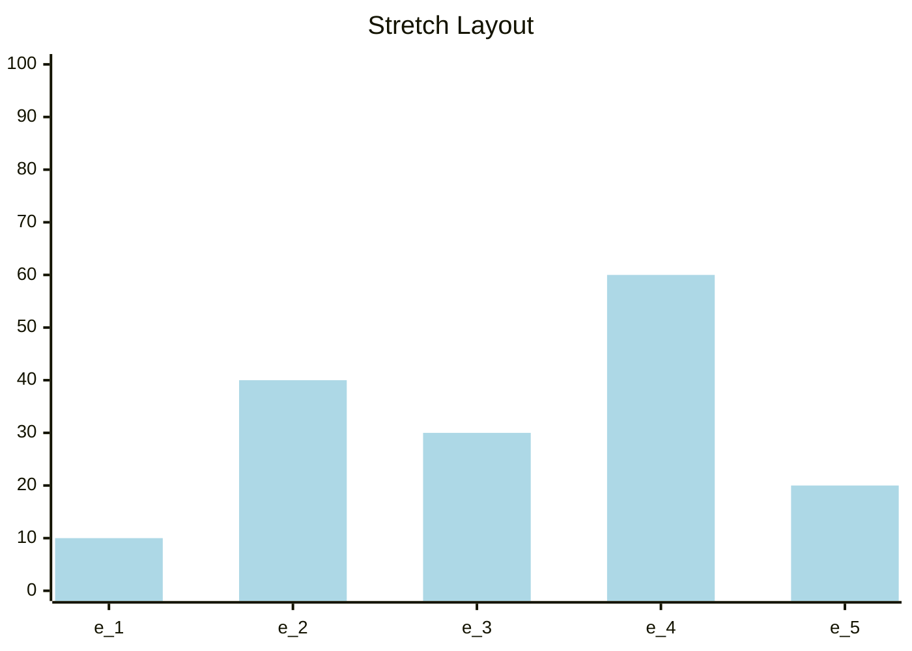
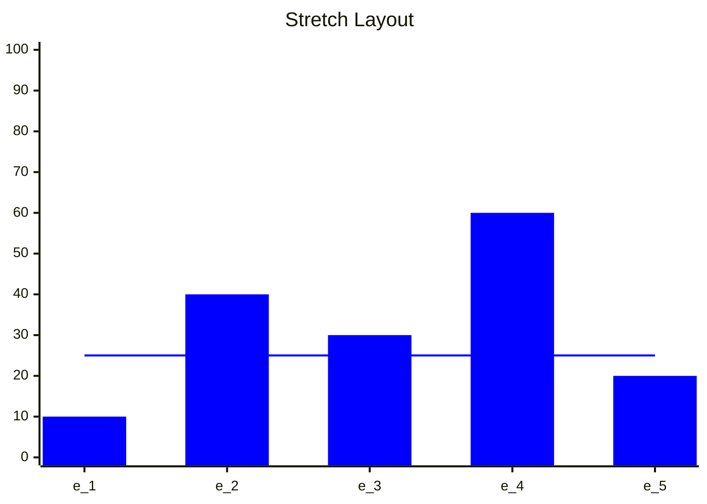

# Stretch to Fill Layout
--------

## Intro
When [Pac-Man][pacman] came out in 1980 it had a resolution of only 224x288 pixels, running on a single custom piece of
hardware.  All of its 256 levels were hand-coded to fit in a 28x36 grid of 8x8 tiles.  Today, modern games have to run
on an incredibly wide variety of screen shapes and sizes.  The same game might run on PCs, consoles, handhelds, cell
phones, and even VR headsets. Game UI has to be dynamic to fit the screen resolution available.  This often means that
the size of some game elements need to stretch to fill a space while others are kept fixed.  Many elements, like buttons
or labels, need minimum constraints on their sizes to ensure they are still readable or clickable.  Getting everything
to fit and still look good can be quite a challenge.  Layout algorithms come in handy here.

## A Layout Problem Defined
One of the simplest, yet problably the _most_ common, layout algorithms is _Stretch to Fill_.  Almost all frameworks
provide some form of this algorithm as a built-in.  Godot, for instance, provides the
[VBoxContainer][godot-vbox-container].  Some details may differ between implementations, but the underlying problem is
the same.  A simple description of this problem might be:

1. For a set of `n` elements $$\lbrace e_1, e_2, ... e_n \rbrace$$, 
2. Where each element `e_i` defines a required minimum constraint: $$\lbrace m_1, m_2, ... m_n \rbrace$$ (such that a
   value of `0` means _no minimum_),
3. **Solve:** Arrange all of the elements to fill a spanning distance `w`, such that:
4. All elements receive **_at least_** their minimum, and otherwise
5. Distribute space between all elements equitably.

This problem, as I have described it, is deliberately underspecified.  There can be several interesting corner cases and
additional constraints.  In the interests of clarity and for the purposes of this post, we will assume the following
additional simplifying assumptions:

1. Elements have no _maximum_ size constraint.
2. If `w` is smaller than the sum of the minimums ($$w \leq \sum_{i=1}^n m_i$$) then give each element its
   minimum.
3. All elements are given _equal weight_ in assigning available space.

Our desired algorithm should solve for the widths (or heights if the distance is arranged vertically) assigned to each
element.

## Building Intuition
To help us understand how the solution will work, let's try to develop an intution through an analogy.  Think of each of
the elements `e_i` as a glass container which holds water.  The height of each container is equal to its required
minimum.  The containers are all placed side-by-side in a larger box just wide enough to hold them all.



The available space `w` that we need to span can be thought of as the total amount of water that we have to work with.
Think of this remaining water as being in a pitcher ready to pour.  To start with, we fill all of the separate `e_i`
containers with water up to their minimums:


If the available water pitcher is then empty, we are done!  All elements MUST get only their minimums (as per our
simplifing assumption (2) above).  However, if water remains, then we can start filling uniformly by pouring water into
the outer box causing the surrounding water level to rise:


As the surrounding water level rises, the water above a given container will increase ONLY once the surrounding water
level has risen enough to meet or exceed that container's minimum.  The surrounding water level, as measured above any
of the submerged containers, will be the same (because that is how water flows).



When the pitcher finally runs out of water, all of the submerged containers will be allocated the level of the
surrounding water.  Any containers remaining above the shared water level, will get their (larger) minimum values.

## Algorithm

So, to code this, let's write a function that, given an available spanning distance and a set of element minimums, will
compute a Stretch to Fill layout.

First we need to take some arguments, and check some base conditions:

```cs
  /// <summary>Computes the minimum spanning distances for a set of elements with minimums.</summary>
  /// <param name="available">The total available spanning distance to cover with all elements.</param>
  /// <param name="mins">On input, the required minimums of each element.</param>
  /// <return>On output, <paramref name="mins"/> is updated to the suggested spanning distance of each element.</return>
  internal static void ComputeFill(double available, Span<double> mins)
  {
    int count = mins.Length;
    // Handle special cases.
    switch (count)
    {
      case 0:
        // Nothing to do.
        return;
      case 1:
        // If only one element, then it always gets everything (or its min, whichever is larger).
        mins[0] = Math.Max(available, mins[0]);
        break;
    }
```

Here `available` is the total available distance we need to fill.  The array `mins` will contain the element minimums on
entry and the assigned values on exit (to avoid allocating).  We need to figure out if there is any space left over
after filling the minimum requirements.  If not, then there is nothing more to do:

```cs
    // Compute the total minimum.
    double total = 0;
    foreach (double d in mins)
    {
      total += d;
    }

    // If there is not enough space (or zero/negative width), then all get their minimum.
    if (available <= 0 || total >= available)
    {
      return;
    }
```

If there is space left over after satisfying all minimums, then we need to compute a layout.

We can make the following observations based on our analogy above.  Whatever the final shared water level is, all of the
elements can be partitioned into one of two sets:

1. Those that are submerged (at or below the shared water level)
2. Those that rise above (whose minimums are all greater than the shared water level).

Furthermore, the final shared water level MUST lie somewhere _between_ the tallest element from group (1) and the
shortest element from group (2).  We can conclude this because: _i._ if the shared level were &le; than the largest from
group (1), then that element wouldn't be part of group (1) at all (a contradition), but would be in group (2).  _ii._
Similarly, if the shared level were &ge; the smallest from group (2) then it wouldn't be in group (2).  _iii._ Lastly,
if group (2) turns out to be empty, then the shared level exceeds _all of the minimums_ and therefore all of the
elements will get the same assignment (equal to `available / count`).

So the crux of the algorithm is: 

Take the smallest element as the initial group (1) with the remaining elements as group (2).  Compute the shared level
for the elements in group (1), _assuming group (2) will get ONLY their minimums_.  If the computed shared level is
higher than the smallest element in group (2), then move that element to group (1) and try again.  Stop when either: we
find a subset for group (1) that satisfies the above observations, or group (2) is empty.  This MUST converge because
group (2) gets smaller with each iteration and so eventually group (2) MUST become empty (if we don't break earlier).

```cs
    // Solve for the highest shared `level` such that all non-participating mins are larger than `level`.
    //
    // 1. Sort the min width from smallest to largest (not including the sentinel at the end, which is always zero).
    Span<double> postfix = count <= StackAllocThreshold ? stackalloc double[count + 1] : new double[count + 1];
    mins.CopyTo(postfix[..count]);
    postfix[..count].Sort();
    postfix[count] = 0;

    // 2. Precompute postfix sums of mins (for convenience).
    for (int i = count - 2; i >= 0; i--)
    {
      postfix[i] += postfix[i + 1];
    }

    // 3. Water-filling: find level.
    double level = available; // starting level
    for (int k = 1; k < postfix.Length; k++)
    {
      // Assume first k elements are at `level` (>= their mins),
      // and the rest (`k` through `count-1`) are clamped at their mins.
      level = (available - postfix[k]) / k;

      // All elements share the same `level` (no higher mins left).
      if (k == count)
      {
        break;
      }

      // If `level` doesn't exceed the next min, then:
      // the first k elements can all be at `level`, and the rest at their mins.
      // Note: nextMin is equal to the difference between the current and the next postfix sums.
      double nextMin = postfix[k] - postfix[k + 1];
      if (level <= nextMin)
      {
        break;
      }

      // Otherwise, `level` is above nextMin, meaning the next element should also be raised.
      // Continue to the next k.
    }
```

There are two _clever parts_ in this code: 

1. We sort the elements ascending by their minimums to make it easier to find the smallest element in group (2) on each
   iteration.
2. We pre-compute into the postfix array the sum of all minimums to the right of each position (including that position
   itself).  At the pivot `k`, then all elements to the right are going to be assigned their minimums, so we will
   subtract the sum of those minimums from `available` *before* computing the shared level for the elements in group (1)
   (those to the left of `k`).

Finally, we make the assignments.  From the loop above we _know_ what the chosen shared level is.  Therefore, all
submerged elements MUST have a level equal to this shared level.  And, all non-submerged elements MUST have their
original minimums.

```cs
    // 4. Assign final widths using `level`.
    for (int i = 0; i < count; i++)
    {
      mins[i] = Math.Max(level, mins[i]);
    }
  }
```

Ta-da!  Each element is assigned a uniformly distributed amount of space while honoring all of the minimum constraints.

## Exercise
As an exercise for the reader: try extending this algorithm such that each element also provides a ratio `weight` that
influences the proportion of the shared level applied to that element.  For example, if `weight = 2.0` then for each
unit of the shared level assigned to other elements, _that_ element would receive _two_ units.  Instead of a uniform
distribution, this would produce a weighted distribution.

## Conclusion
In this is post, we looked at a **Stretch to Fill** algorithm.  Algorithms like this help game designers build dynamic
UI that adapts itself automatically to different screen sizes and resolution while still remaining functional.  Even
when I plan on leveraging an existing layout implementation provided by my favorite game engine or framework, I often
find it useful to have an understanding of what is happening under the hood.  I hope this is useful for you too.  Until
next time, keep your head above water, and code on!

## Previous
Read the [previous post][devlog-post11] in this series.

## Feedback
Write us with [feedback][feedback].

## See Also
* [All Posts][all-posts]
* [Glossary][glossary]
* [MSC (Marymoor Studios Core libraries)][MSC]

[MSC]: https://github.com/MarymoorStudios/Core
[all-posts]: /devlog.html
[devlog-post11]: /devlog/2025-12-16-HSM
[feedback]: mailto:feedback@marymoorstudios.com
[glossary]: /devlog/Glossary
[pacman]: https://en.wikipedia.org/wiki/Pac-Man
[godot-vbox-container]: https://docs.godotengine.org/en/stable/classes/class_vboxcontainer.html
